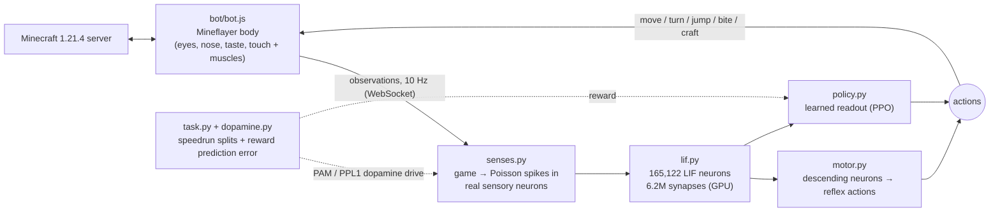

# Fruit Fly Brain × Minecraft

**A complete, simulated fruit-fly nervous system plays Minecraft.**

The controller is the **male CNS connectome (MaleCNS v1.0)** released by **Google Research and HHMI Janelia** in September 2026. It contains all 165,122 neurons and 6.2 million synaptic connections of an adult male *Drosophila*: brain, optic lobes and ventral nerve cord. Every neuron runs live as a spiking neuron on the GPU:
- Game senses are turned into spikes in the fly's *real* sensory neurons.
- The fly's *real* descending neurons, which carry commands from brain to body, steer a Mineflayer bot around a Minecraft world.

On top of those reflexes, a small learned layer is trained with reinforcement learning to **speedrun the Minecraft tech tree**. A **dopamine-like reward** also fires the fly's own dopamine neurons.



---

## Contents
- [Highlights](#highlights)
- [How the brain works](#how-the-brain-works)
- [How the fly senses and acts](#how-the-fly-senses-and-acts)
- [Checking the circuits are fly-like](#checking-the-circuits-are-fly-like)
- [Learning: speedrun + dopamine](#learning-speedrun--dopamine)
- [Watching it think](#watching-it-think)
- [Requirements](#requirements)
- [Setup](#setup)
- [Running](#running)
- [Project layout](#project-layout)
- [Tuning](#tuning)
- [Troubleshooting](#troubleshooting)
- [Limitations and honest caveats](#limitations-and-honest-caveats)
- [Credits and licences](#credits-and-licences)

---

## Highlights

- **Whole-CNS spiking simulation:** all 165,122 traced neurons and 6,235,649 connections (neuron pairs with ≥5 synapses). It uses the leaky integrate-and-fire model of Shiu et al., *Nature* 2024, at dt = 0.1 ms.
- **Faster than real time:** 1.8× real time for one fly on an RTX 5070, and about 4× total throughput for 8 flies. This comes from CUDA graphs plus exact event-driven spike delivery.
- **Real neurons in and out:** photoreceptors, looming detectors, olfactory and taste receptor neurons, bristles and Johnston's organ in; descending neurons such as the giant fiber, MDN "moonwalker" and DNa01/02 steering neurons out.
- **Taste neurons found by experiment:** sugar and bitter types were *identified by simulating the connectome*, not hand-picked.
- **Fly-like vision:** each compound eye covers 180° × 140° (about 330° total), sampled by 192 rays per eye.
- **Tech-tree speedrun:** logs → crafting table → pickaxes → iron, with split times, crafting macros and action masking.
- **Dopamine reward:** curiosity, approach and anti-circling signals form a reward-prediction error that fires the fly's **PAM (reward)** and **PPL1 (punishment)** dopamine neurons.
- **Live visualisation:** a 3D whole-brain view where every neuron flashes as it spikes, including a calcium-imaging-style mode, plus a dashboard and a first-person game view.

---

## How the brain works

### Data
`brain/flybrain/fetch_data.py` downloads the public flat-connectome files from `storage.googleapis.com/flyem-male-cns/v1.0/` (about 1.2 GB, no login needed):

| File | Used for |
|---|---|
| `body-annotations-male-cns-v1.0-minconf-0.5.feather` | neuron types, classes, sides, soma positions |
| `body-neurotransmitters-male-cns-v1.0.feather` | predicted neurotransmitter per neuron |
| `connectome-weights-male-cns-v1.0-minconf-0.5.feather` | neuron-to-neuron synapse counts |

`connectome.py` builds a signed graph:
- **Neurons:** every body with `status == "Traced"`.
- **Edges:** pairs with ≥5 synapses.
- **Signs:** GABA and glutamate are inhibitory; everything else is excitatory.

The result is cached as `data/graph.pt`.

### Neuron model (`lif.py`)
Shiu et al. (2024) leaky integrate-and-fire:

```
dv/dt = (v_rest − v + g) / τm        dg/dt = −g / τsyn
spike when v > v_thresh → reset, refractory; after 1.8 ms every target gets g += 0.275 mV × gain × synapses
```

| Parameter | Value |
|---|---|
| τm / τsyn | 20 ms / 5 ms |
| rest = reset / threshold | −52 mV / −45 mV |
| refractory / synaptic delay | 2.2 ms / 1.8 ms |
| global gain | 0.65 |
| Kenyon-cell input gain | 0.25 (keeps mushroom-body coding sparse, ~6% active) |
| sensory input | Poisson spikes, up to 150 Hz, 68.75 mV per input spike |

### Why it runs faster than real time
1. **Chunking by synaptic delay:** a spike at step *t* can't reach its targets before step *t* + 18. So 18 steps of membrane dynamics are integrated using already-buffered input. This is exact, not an approximation.
2. **CUDA graphs:** that 18-step inner loop is captured once and replayed, which removes Python and kernel-launch overhead.
3. **Event-driven delivery:** only about 1–7% of neurons fire. Their outgoing synapses are gathered and scattered in one `index_add_` per chunk, instead of multiplying through all 6.2M synapses every step.

Plain sparse matrix multiplication ran at 0.2× real time. With these changes it runs at 1.8×.

---

## How the fly senses and acts

### Senses → real sensory neurons (`senses.py`, `bot.js`)

| Minecraft | Fly neurons driven |
|---|---|
| Ray-cast luminance, two panoramic eyes (180°×140° each, 12×16 rays) | R1–R6 photoreceptors (per side) |
| Mob approaching (angular size growing) | LC4, LPLC2 looming detectors (per side) |
| Animals, food items, crops | Fruity-odour ORNs DM1, DM4, VA2, DM2 (per antenna) |
| Hostile mobs, lava, fire | Aversive ORNs V (CO₂), DA2 (geosmin) |
| Logs, dropped items | Plant-volatile ORNs DL5, VM7 |
| Food within reach | Sugar gustatory neurons |
| Hostile mob / lava in contact | Bitter gustatory neurons |
| Walls at the side, collisions | Head bristle mechanosensory neurons |
| Falling, knockback | Johnston's organ C/E (gravity, wind) |
| Damage, nearby sounds | Johnston's organ A/B (vibration) |
| Reward / punishment surprise | PAM / PPL1 dopamine neurons |

### Descending neurons → actions (`motor.py`)

| Neurons | Action |
|---|---|
| DNa01 / DNa02, left–right difference | steer |
| DNp09 (P9) | walk forward |
| MDN ("moonwalker") | walk backward |
| DNp01 (giant fiber) | escape: jump + sprint |
| DNp07 / DNp10 | landing / take-off → jump |
| DNg12 (grooming) | stop |
| MN9 (proboscis motor neuron) | bite / eat |

The reflex decoder produces **logits** for each action head: move, turn, pitch, jump, sprint, attack, use and craft. The learned readout adds to them, so with an untrained readout the body is controlled purely by the fly's reflexes. Real flies walk in persistent bouts with occasional saccade-like turns, and a slow random "exploration drive" adds this.

---

## Checking the circuits are fly-like

`python -m flybrain.probe check` stimulates each sensory group inside the full connectome and records descending-neuron output:

| Stimulus | Response |
|---|---|
| Looming (LC4/LPLC2) | giant fiber DNp01 fires at **~280–340 Hz** (escape) |
| Looming on the left | right-side steering neuron DNa01_R (turn away) |
| Sugar | feeding motor neuron MN9 at **~175–200 Hz** |
| Food odour, left | DNa02_L > DNa02_R (turn toward) |
| Head bristle touch | grooming DNs plus MDN (back away) |
| Wind (Johnston's organ C/E) | antennal grooming |

**Finding the taste neurons by simulation:**
- `probe screen-taste` stimulates every gustatory cell type and measures MN9. The sugar types (LB3c/d, LB2a, LB4a/b, tarsal claw and dorsal GRNs) drive feeding.
- `probe screen-bitter` stimulates sugar plus each candidate type. LB1b/c/e, LgAG3/5 and PhG8/16 cut sugar-evoked MN9 firing from 183 Hz to 9–19 Hz, matching how bitter taste suppresses feeding in real flies.

**Control experiment:** `--shuffled` (on `probe`, `run` and `train`) rewires the connectome at random while keeping each neuron's out-degree.

---

## Learning: speedrun + dopamine

### What is trained
Only the **readout** in `policy.py` is trained, using **PPO**. The 165k-neuron connectome is never changed.

The readout's inputs:
- **Fly features:** firing rates of all 2,129 descending and motor neurons, the same bottleneck through which a real brain talks to its body.
- **Task vector:** item counts, milestones reached, the block under the crosshair, whether a table or furnace is nearby, health, food and the timer. The fly has no neurons for "how many planks do I have", so this comes straight from the game.

Its output heads start at zero, so training begins from the pure fly.

### Speedrun task (`task.py`, default)
Each fly races through the tech tree, and every milestone gets a split time:

`log → 3 logs → planks → crafting table → wooden pickaxe → cobblestone → stone pickaxe → raw iron → furnace → iron ingot`

- **Scoring:** each milestone pays a reward, doubled at most if the split beats par.
- **Attempts:** each attempt lasts up to 15 minutes, or ends on death or completion. The fly is then cleared and re-spread in a forest.
- **Crafting:** the `craft` head chooses planks, sticks, crafting table, wooden or stone pickaxe, furnace, or smelt iron. `bot.js` runs each as a macro, placing the table or furnace, crafting and loading the furnace. Crafts that are impossible or wasteful are **masked out** every cycle.
- **Sticky mining:** once the fly starts breaking a block it keeps going, so it doesn't need to pick "attack" 30 times in a row.

### Dopamine reward (`dopamine.py`)

| Signal | Sign | Meaning |
|---|---|---|
| novelty | + | curiosity: new 2-block cells, nothing for revisits |
| approach | + | getting closer to the next resource (logs, then stone) |
| in_view | + | that resource is under the crosshair |
| mined / collected | + | breaking blocks, picking up items |
| milestone | ++ | the big burst |
| circling | − | little displacement or lots of spinning over 5 s |
| damage / death | − | getting hurt |
| step | − | time pressure |

- **Reward prediction error:** a running baseline turns the reward into an RPE, the "better or worse than expected" signal that real dopamine neurons encode.
- **PAM firing:** positive surprise fires the 316 **PAM** reward neurons.
- **PPL1 firing:** negative surprise fires the 24 **PPL1/PPL2** punishment neurons.
- **Logging:** each component is written as `dopa_*` in `runs/<run>/metrics.jsonl`.

### Survival curriculum (`--task survival`)
The alternative task runs three stages: explore (peaceful, daytime) → gather (logs rewarded) → survive (normal difficulty, day/night cycle).

---

## Watching it think

| URL | What |
|---|---|
| http://localhost:8000 | Dashboard: descending-neuron rates, spike raster, sensory drive, dopamine meter and sparkline, speedrun splits, training stats |
| http://localhost:8000/brain | Whole-brain 3D view: all 165k neurons at their real soma positions, flashing as they spike; lines show synapses between co-active neurons (orange excitatory, blue inhibitory) |
| http://localhost:8000/brain?view=imaging | Calcium-imaging-style front view of the brain (optic lobes cyan, central brain magenta) |
| http://localhost:3007 | Fly0's first-person view (prismarine-viewer) |
| `localhost:25565` | Join with your own Minecraft 1.21.4 client |

In the brain view you can pick which fly to watch, toggle connections and the nerve cord, and highlight circuits such as `motor · DNp01` (escape) or `sense · dan reward` (dopamine).

---

## Requirements

- Windows 10/11. The scripts are PowerShell; the Python and Node code is cross-platform.
- NVIDIA GPU with CUDA and about 4 GB of free VRAM for 4 flies (developed on an RTX 5070, 12 GB).
- 16 GB RAM, about 6 GB of disk (connectome data, Python environment, server).
- Python 3.12 (installed into `.venv` by `uv`), Node.js 20+.
- Java 21 for the Minecraft server. Setup downloads a portable Temurin JRE into `tools/`.
- A Minecraft 1.21.4 client is **not** required; the bots are the players.

---

## Setup

```powershell
git clone https://github.com/Adarsh-Aravind/Fruit-Fly-Brain-Mincecraft-Controller.git
cd Fruit-Fly-Brain-Mincecraft-Controller
.\scripts\setup.ps1
```

`setup.ps1` does the following:
- Creates `.venv` and installs `requirements.txt`, including PyTorch cu128.
- Runs `npm install` in `bot/`.
- Downloads the MaleCNS data and builds `data/graph.pt` and `data/brainmap.npz`.
- Downloads the official 1.21.4 `server.jar` from Mojang and a portable Java 21.

Then **read the [Minecraft EULA](https://aka.ms/MinecraftEULA)**. If you agree, set `eula=true` in `server/eula.txt`.

Check the brain works without Minecraft:

```powershell
cd brain
..\.venv\Scripts\python.exe -m flybrain.selftest     # full pipeline on synthetic senses
..\.venv\Scripts\python.exe -m flybrain.lif          # speed benchmark
..\.venv\Scripts\python.exe -m flybrain.probe check  # reflex circuits
```

---

## Running

Open separate terminals:

```powershell
.\scripts\server.ps1                                           # 1. Minecraft server (localhost, offline mode)

.\scripts\play.ps1 --pure-fly                                  # 2a. one fly, reflexes only
.\scripts\train.ps1 --task speedrun --bodies 4 --run speedrun2 # 2b. train the speedrun with 4 flies
.\scripts\train.ps1 --task survival --bodies 4 --run survival  # 2c. survival curriculum
.\scripts\play.ps1 --checkpoint ..\runs\speedrun2\latest.pt    # 2d. play with a trained readout
```

Training resumes automatically from `runs/<run>/latest.pt`; `--fresh` starts over.

**Useful flags**

| Flag | Default | Meaning |
|---|---|---|
| `--bodies` | 4 (train) / 1 (play) | number of flies sharing one batched brain |
| `--task` | speedrun | `speedrun` or `survival` |
| `--episode-seconds` | 900 | speedrun attempt time limit |
| `--horizon` | 128 | control cycles per PPO update |
| `--updates` | 2000 | stop after this many PPO updates |
| `--window-ms` / `--hz` | 100 / 10 | neural time simulated per decision / decisions per second |
| `--shuffled` | off | control condition with random wiring |
| `--pure-fly` | off | (`play`) ignore the readout |
| `--spawn-x`, `--spawn-z`, `--spread` | 591, 670, 48 | where flies are re-spread (a forest for seed 20260903) |

**Outputs**

In `runs/<run>/`:
- `metrics.jsonl`: PPO losses, entropy, reward, `dopa_*` components, reflex agreement.
- `splits.jsonl`: one line per finished attempt, with its milestone split times.
- `best_splits.json`: best time per milestone.
- `latest.pt` and `readout_XXXXX.pt`: checkpoints.

---

## Project layout

```
bot/
  bot.js              Mineflayer body: senses (eyes, odour, taste, touch, wind), motor + crafting macros, viewer
brain/flybrain/
  fetch_data.py       download MaleCNS feathers
  connectome.py       build/load signed graph, neuron selection, shuffled control
  lif.py              GPU LIF simulator (CUDA graphs + event-driven delivery)
  senses.py           observations -> Poisson rates on sensory + dopamine neurons
  motor.py            descending neurons -> reflex logits, action heads, exploration drive
  policy.py           learned readout (PPO actor-critic)
  task.py             speedrun milestones, task vector, craft masks, rewarder
  dopamine.py         dopamine-like reward, RPE, PAM/PPL1 drive
  bridge.py           WebSocket body server, Agent (think loop), dashboard + brain-view endpoints
  run.py              play
  train.py            PPO training (speedrun / survival)
  probe.py            stimulus-response experiments (taste screens, reflex check)
  brainmap.py         3D positions of all neurons for the brain view
  selftest.py         offline end-to-end test
  dashboard.html      dashboard
  brain.html          whole-brain 3D / imaging view (three.js)
scripts/              setup.ps1, server.ps1, play.ps1, train.ps1
server/               server.properties (offline, localhost-only, RCON for resets)
```

---

## Tuning

- **Reward shaping:** `DOPAMINE_WEIGHTS` in `dopamine.py`, and `MILESTONES` (reward and par time) in `task.py`.
- **Neuron model:** `LIFParams` in `lif.py` (gain, Kenyon-cell input gain, time constants).
- **Senses:** max rates and neuron groups in `senses.py`; eye field of view and resolution in `bot.js` (`EYE_ROWS`, `EYE_COLS`, `EYE_AZIMUTH`, `EYE_ELEVATION`). Keep `EYE_ROWS` and `EYE_COLS` in sync with `senses.py`.
- **Reflexes:** `reflex_logits` in `motor.py`.
- **PPO:** the `PPO(...)` defaults in `train.py` (learning rate, clip, entropy coefficient 0.003).

---

## Troubleshooting

| Symptom | Fix |
|---|---|
| Server exits immediately | Set `eula=true` in `server/eula.txt`, and make sure Java 21 is present (`tools/jre21`) |
| `viewer failed: Cannot find module 'canvas'` | `cd bot; npm install canvas` |
| Dashboard says "brain offline" | The brain process isn't running, or port 8000 is in use |
| Brain view is black in a background tab | Browsers pause WebGL in hidden tabs; bring it to the front |
| Very slow cycles | Lower `--bodies`, or check `nvidia-smi` that PyTorch is using the GPU |
| A fly never reappears after a restart | Bots reconnect automatically after 5 s; check the bot console for `kicked` |

---

## Limitations and honest caveats

- **A wiring map, not a trained model:** the connectome gives structure, not learned behaviour. Synapse strengths come from synapse counts, and signs come from *predicted* neurotransmitters. There are no gap junctions, neuromodulation dynamics or plasticity.
- **Hand-designed interface:** the mapping from Minecraft to sensory neurons, and from descending neurons to actions, was designed by hand. It is biologically motivated, but not a biophysical eye or leg.
- **Task-level inputs don't come from the brain:** crafting decisions and the task vector bypass the fly brain, and crafting runs as macros. Movement, aiming and attacking still go through the fly's descending-neuron reflexes plus the learned readout.
- **Hard learning problem:** this is RL from scratch, with no human demonstrations, on one GPU, below real time. Early milestones (logs, crafting table) are realistic within hours. Iron is a long shot, and beating the game is out of scope.
- **Offline server:** `server.properties` uses `online-mode=false` and binds to `127.0.0.1`. Don't expose it to the internet.

---

## Credits and licences

- **This project's code:** [MIT License](LICENSE). The connectome data, Minecraft and third-party libraries keep their own licences, listed below.
- **Connectome:** MaleCNS v1.0, © HHMI Janelia FlyEM, Google Research, University of Cambridge, MRC LMB and collaborators. Berg et al., *Cell* (2026). Data licensed **CC BY 4.0**. Data is downloaded at setup and not redistributed here.
- **Neuron model:** Shiu, P. K. et al. "A Drosophila computational brain model reveals sensorimotor processing." *Nature* (2024).
- **Prior art that inspired calibration choices:** [blendi-remade/fly-brain-minecraft](https://github.com/blendi-remade/fly-brain-minecraft) (MIT).
- **Libraries:** PyTorch, Mineflayer and prismarine-viewer (PrismarineJS), three.js, Apache Arrow.
- **Minecraft** is a trademark of Mojang Studios / Microsoft. This project is not affiliated with them. The server jar is downloaded from Mojang and runs under the Minecraft EULA.
